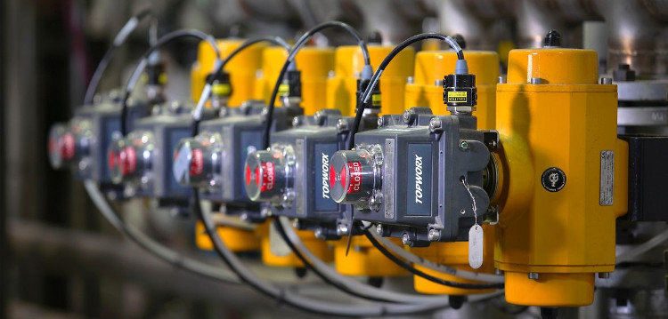

<h1 align="center">Energy Comsumption Prediction Using Machine Learning</h1>

## Authors

- 👤 **Angélica Gloria V**  Github: [@AngieG10](https://github.com/AngieG10)
- 👤 **Julio Padilla Avilés**  Github: [@Axioma42](https://github.com/Axioma42)
- 👤 **Luis Campero**  Github: [@Patabu2](https://github.com/Patabu2)

With the growing need to optimize sustainable development and the efficiency of energy consumption, a precise and complete measurement of all consumption processes is necessary. Therefore, numerous sensors and metrics are required, which can be highly expensive.

To keep the number of sensors to a minimum, machine learning algorithms could be trained to predict the energy usage of devices by the effect that they have on the main electrical input, as well as other variables such as temperature and business-specific data.

The aim of this project is to use the electrical measurements from the main electric meter as well as temperature and time data to predict the electric usage of the devices from a standardized restaurant chain. This way, only all sensors should be installed in a single site, which would be the basis for the construction of the predictive model.

Followin the idea, from April 2018 to November 2019 data was collected from the site that we used as basis by installing meters on several groups of devices, as well as on big devices. The devices were the Lavaloza, Lighting, Refrigeration 1 and 2, Contacts & Air conditioning and Ventilation.

The measurements provided by the meter on the main input (power meter) are current, frequency and voltage, and with them other parameters such as power, reactive power, power factor and energy can be calculated.

On the other hand, the meters installed on the other devices only measure current and use the voltage measurement from the power meter on the main input to transform it into power and energy.

- The predicted variable for all the devices was the **current**.

Two models were tested for each device and are discussed below: **Gradient Boosting Regressor** and **Multilayer Perceptron**. This resulted in 12 different models, one for each device. 

### The idea behind this is to try to replace a physical sensor with a *“digital”* one.

  
  

## Building the models

### Gradient Boosting Regressor

A Gradient Boosting Regressor is a comprehensive Supervised Machine Learning Algorithm which is based on decition trees that recursevely partitions the inputs by using feature threshold functions. Unlike other similar methods like random forests, boosting learn is a sequential manner. This means that each member of the asamble is an expert on its predecesor error, making it a very strong predictor on non linear functions. Also, it can handdle very well multiple meter scales in data.

**For this reasons, we chose the Gradient Boosting Regressor as our main model.**

- As a first step for building a GridSearch was instantiated with the hyperparameters n_estimators, max_depth and learning_rate.
- Afterwards, the GridSearchCV was used to estimate the best hyperparamenters to use in each single device, and the results were stored to use in the final models.
- The scores for the training and test sets are shown below:
- The feature importances of each model are:

For every model the most important feature is the current of the main input of electricity, while the power factor also plays an important role in all of them.

The external temperature has little effect on most devices, except for the ones related to refrigeration, in which the temperature has a significant effect.

Time-related data seems to be especially important in the Contacts and Refrigeration, probably because during the day there are more people in the restaurant and these devices are used more.

## Multilayer Perceptron

A similar process was repeated for the multilayer perceptron, in which a GridSearch was run for every device and the data was trained with the training set and tested on the test set.

The scores for the neural network are shown below.

The Gradient Boosting Regressor was chosen as it was easier to tune and returned more accurate results than the MLP. Also, it is harder to know which features are more relevant for a neural network, so the model becomes harder to interpret and explain.

Results
https://app.powerbi.com/view?r=eyJrIjoiZDM0MjMyZjEtODg0Ny00ODc5LThlY2EtYmE3NjE0YzBmOTliIiwidCI6ImQ0MmQxMThhLTMxNjQtNDY3MS1hZjk4LTZkMzkwNTljZTcwYiJ9
